# Hardware and tools
- rpi zero w v1.1
- rpi on qemu
- gdb with [gef](https://hugsy.github.io/gef/)
>GNU gdb (Raspbian 10.1-1.7) 10.1.90.20210103-git
- vim

# Raspberry PI on QEMU
For the kernel 5.4.51 (Raspbian Buster Lite):
```
$ qemu-system-arm \
  -M versatilepb \
  -cpu arm1176 \
  -m 256 \
  -drive "file=/.../2020-05-27-raspios-buster-lite-armhf.img,if=none,index=0,media=disk,format=raw,id=disk0" \
  -device "virtio-blk-pci,drive=disk0,disable-modern=on,disable-legacy=off" \
  -net "user,hostfwd=tcp:127.0.0.1:5022-:22" \
  -net nic \
  -dtb /.../versatile-pb-buster-5.4.51.dtb \
  -kernel /.../kernel-qemu-5.4.51-buster \
  -append 'root=/dev/vda2 panic=1' \
  -no-reboot
```
On guest:
>sudo systemctl start ssh 

On host:  
>ssh pi@127.0.0.1 -p 5022  

Kernel images: https://github.com/dhruvvyas90/qemu-rpi-kernel

# Hexadecimal Arithmetic
## Hexadecimal Number System
- Uses 10 digits and 6 letters: 0, 1, 2, 3, 4, 5, 6, 7, 8, 9, A, B, C, D, E, F;   
- Letters represents numbers starting from 10. A = 10, B = 11, C = 12, D = 13, E = 14, F = 15; 
- Each position in a hexadecimal number represents a 0 power of the base (16);  
- Last position in a hexadecimal number represents an x power of the base (16).

## Hexadecimal Addition
| <!-- -->| <!-- -->| <!-- -->|
| - | - | - |
| A | 1 | 5 |
| | B | С |
| A | D | 1 |

1. 5 + C(12) = 17 > 16 => 17-16 = 1 (+1 keep in mind)
2. 1 + 1 (from p. 1) + B(11) = 13(D)

## Hexadecimal Subtraction
| <!-- -->| <!-- -->| <!-- -->|
| - | - | - |
| B | C | 4 |
| | A | F |
| B | 1 | 5 |

1. 4 - F(15) = 16 + 4 - F(15) = 5 (-1 keep in mind)
2. C(12) - 1 (fro, p. 1) - A(10) = 1

# Basic load example
Generally, LDR is used to load something from memory into a register, and STR is used to store something from a register to a memory address.  
Source code: [ldr.s](./ldr.s)

The first LDR loads the address of var1 into register R0.
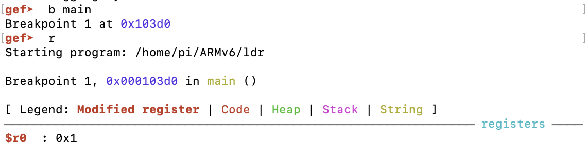

The second LDR does the same for var2 and loads it to R1.
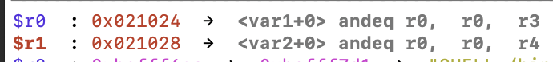

Then we load the value stored at the memory address found in R0 to R2, and store the value found in R2 to the memory address found in R1.


# 1. Offset form: Immediate value as the offset
Here we use an immediate (integer) as an offset. This value is added or subtracted from the base register (R1 in the example below) to access data at an offset known at compile time.  
Source code: [immediate_value_as_the_offset.s](./immediate_value_as_the_offset.s)  

In GDB (with gef) we set a break point at main and run the next 3 instructions.
The registers are now filled with the following values:
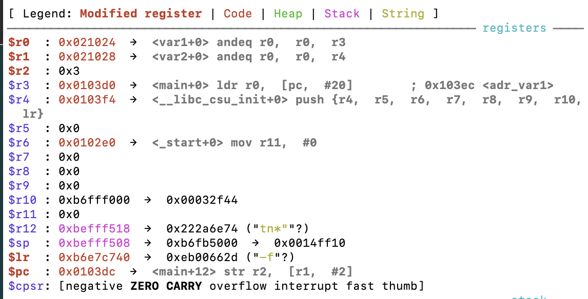

The next instruction that will be executed a STR operation with the *offset address mode*. It will store the value from R2 (0x3) to the memory address specified in R1 (0x021028) + the offset (#2) = 0x02102a.  
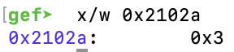  

The next STR operation uses the *pre-indexed address mode*. You can recognize this mode by the exclamation mark (!). The only difference is that the base register will be updated with the final memory address in which the value of R2 will be stored. This means, we store the value found in R2 (0x3) to the memory address specified in R1 (0x021028) + the offset (#4) = 0x02102c, and update R1 with this exact address.
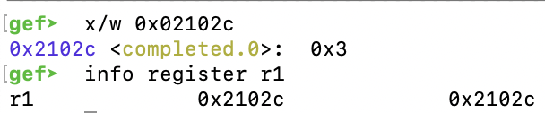

The last LDR operation uses the *post-indexed address mode*. This means that the base register (R1) is used as the final address, then updated with the offset calculated with R1+4. In other words, it takes the value found in R1 (not R1+4), which is 0x02102c and loads it into R3, then updates R1 to R1 (0x02102c) + offset (#4) =  0x021030.
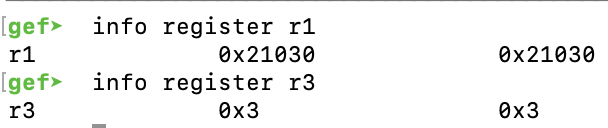

# 2. Offset form: Register as the offset.
This offset form uses a register as an offset. An example usage of this offset form is when your code wants to access an array where the index is computed at run-time.
Source code: [register_as_the_offset.s](./register_as_the_offset.s)  

After executing the first STR operation with the *offset address mode*, the value of R2 (0x3) will be stored at memory address 0x021021 + 0x4 = 0x021024.
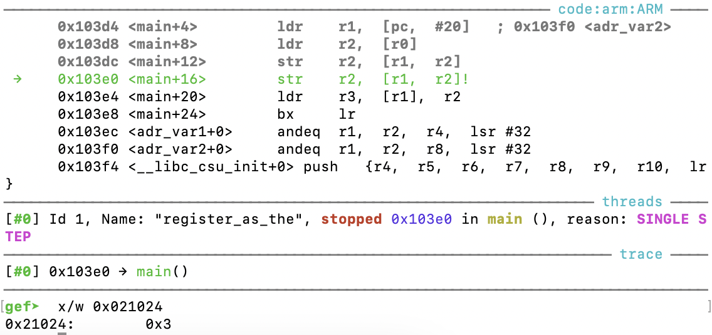

The second STR operation with the *pre-indexed address mode* will do the same, with the difference that it will update the base register (R1) with the calculated memory address (R1+R2).
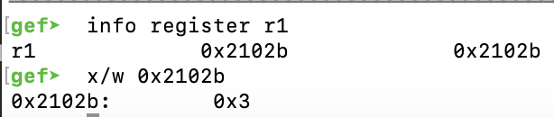

The last LDR operation uses the post-indexed address mode and loads the value at the memory address found in R1 into the register R2, then updates the base register R1 (R1+R2 = 0x02102b + 0x3 = 0x02102e).
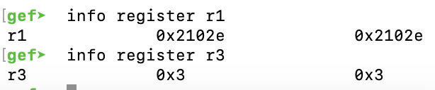

# 3. Offset form: Scaled register as the offset
The third offset form has a scaled register as the offset. In this case, Rb is the base register and Rc is an immediate offset (or a register containing an immediate value) left/right shifted (`<shifter>`) to scale the immediate. This means that the barrel shifter is used to scale the offset.  
Source code [scaled_register_as_the_offset.s](./scaled_register_as_the_offset.s)  

The first STR operation uses the *offset address mode* and stores the value found in R2 at the memory location calculated from [r1, r2, LSL#2], which means that it takes the value in R1 as a base (in this case, R1 contains the memory address of var2), then it takes the value in R2 (0x3), and shifts it left by 2.
| R0 | R1 | R2 |
| - | - | - |
| 0x021024 | 0x021028 | 0x3

1. 0x3 in binary = b0011
2. b0011 LSL#2 = b1100 = 0xC
3. 0x021028 (base) + 0xC (offset) = 0x021034

The second STR operation uses the *pre-indexed address mode*. This means, it performs the same action as the previous operation, with the difference that it updates the base register R1 with the calculated memory address afterwards. In other words, it will first store the value found at the memory address R1 (0x021028) + the offset left shifted by #2 (0x03 LSL#2 = 0xC) = 0x021034, and update R1 with 0x021034.
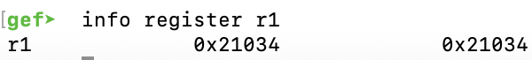

The last LDR operation uses the post-indexed address mode. This means, it loads the value at the memory address found in R1 (0x021034) into register R3, then updates the base register R1 with the value calculated with r2, LSL#2. In other words, R1 gets updated with the value R1 (0x021034) + the offset R2 (0x3) left shifted by #2 (0xC) = 0x021040.
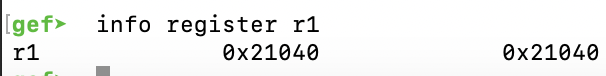

# Summary
There are three offset modes in LDR/STR:
1. offset mode uses an *immediate* as offset
>ldr   r3, [r1, #4]

2. offset mode uses a *register* as offset
>ldr   r3, [r1, r2]

3. offset mode uses a *scaled register* as offset
ldr   r3, [r1, r2, LSL#2]

How to remember the different address modes in LDR/STR:
1. If there is a !, it’s prefix address mode
>ldr   r3, [r1, #4]!  
>ldr   r3, [r1, r2]!  
>ldr   r3, [r1, r2, LSL#2]!

2. If the base register is in brackets by itself, it’s postfix address mode
>ldr   r3, [r1], #4  
>ldr   r3, [r1], r2  
>ldr   r3, [r1], r2, LSL#2

3. Anything else is offset address mode.
>ldr   r3, [r1, #4]  
>ldr   r3, [r1, r2]  
>ldr   r3, [r1, r2, LSL#2]

# Load/Store Multiple
Sometimes it is more efficient to load (or store) multiple values at once. For that purpose we use LDM (load multiple) and STM (store multiple). These instructions have variations which basically differ only by the way the initial address is accessed.  
Source code: [ldm_stm.s](./ldm_stm.s)

We use ADR instruction (lazy approach) to get the address of the 4th (words[3]) element into the R0. We point to the middle of the words array because we will be operating forwards and backwards from there.
R0 now contains the address of word[3], which in this case is 0x80B8. This means, our array starts at the address of word[0]: 0x010408 (0x010414 –  0xC).
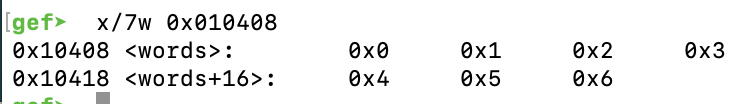

We prepare R1 and R2 with the addresses of the first (array_buff[0]) and third (array_buff[2]) elements of the array_buff array. Once the addresses are obtained, we can start operating on them.
>ldr r1, array_buff_bridge    /* address of array_buff[0] -> r1 */  
>ldr r2, array_buff_bridge+4  /* address of array_buff[2] -> r2 */

After executing the two instructions above, R1 and R2 contain the addresses of array_buff[0] and array_buff[2]
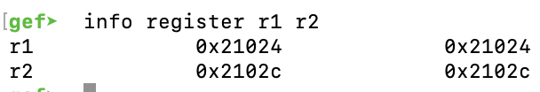

The next instruction uses LDM to load two word values from the memory pointed by R0. So because we made R0 point to words[3] element earlier, the words[3] value goes to R4 and the words[4] value goes to R5.
>ldm r0, {r4,r5}              /* words[3] -> r4 = 0x03; words[4] -> r5 = 0x04 */

We loaded multiple (2 data blocks) with one command, which set R4 = 0x00000003 and R5 = 0x00000004.
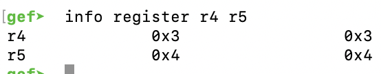

Now let’s perform the STM instruction to store multiple values to memory. The STM instruction in our code takes values (0x3 and 0x4) from registers R4 and R5 and stores these values to a memory location specified by R1. We previously set the R1 to point to the first array_buff element so after this operation the array_buff[0] = 0x00000003 and array_buff[1] = 0x00000004. If not specified otherwise, the LDM and STM opperate on a step of a word (32 bits = 4 byte).
>stm r1, {r4,r5}              /* r4 -> array_buff[0] = 0x03; r5 -> array_buff[1] = 0x04 */

The values 0x3 and 0x4 should now be stored at the memory address 0x021024 and 0x021028. The following instruction inspects two words of memory at the address 0x021024.  
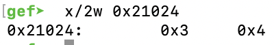

LDM and STM have variations. The type of variation is defined by the suffix of the instruction. Suffixes used in the example are: -IA (increase after), -IB (increase before), -DA (decrease after), -DB (decrease before). These variations differ by the way how they access the memory specified by the first operand (the register storing the source or destination address). In practice, LDM is the same as LDMIA, which means that the address for the next element to be loaded is increased after each load. In this way we get a sequential (forward) data loading from the memory address specified by the first operand (register storing the source address).
>ldmia r0, {r4-r6} /* words[3] -> r4 = 0x03, words[4] -> r5 = 0x04; words[5] -> r6 = 0x05; */  
>stmia r1, {r4-r6} /* r4 -> array_buff[0] = 0x03; r5 -> array_buff[1] = 0x04; r6 -> array_buff[2] = 0x05 */

After executing the two instructions above, the registers R4-R6 and the memory addresses 0x021024, 0x021028, and 0x02102c contain the values 0x3, 0x4, and 0x5.
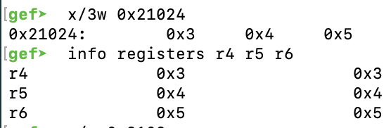

The LDMIB instruction first increases the source address by 4 bytes (one word value) and then performs the first load. In this way we still have a sequential (forward) loading of data, but the first element is with a 4 byte offset from the source address. That’s why in our example the first element to be loaded from the memory into the R4 by LDMIB instruction is 0x00000004 (the words[4]) and not the 0x00000003 (words[3]) as pointed by the R0.
>ldmib r0, {r4-r6}            /* words[4] -> r4 = 0x04; words[5] -> r5 = 0x05; words[6] -> r6 = 0x06 */  
>stmib r1, {r4-r6}            /* r4 -> array_buff[1] = 0x04; r5 -> array_buff[2] = 0x05; r6 -> array_buff[3] = 0x06 */

After executing the two instructions above, the registers R4-R6 and the memory addresses 0x21028, 0x2102c, and 0x21030 contain the values 0x4, 0x5, and 0x6.
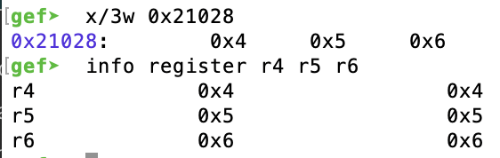

When we use the LDMDA instruction everything starts to operate backwards. R0 points to words[3]. When loading starts we move backwards and load the words[3], words[2] and words[1] into R6, R5, R4. Yes, registers are also loaded backwards. So after the instruction finishes R6 = 0x00000003, R5 = 0x00000002, R4 = 0x00000001. The logic here is that we move backwards because we Decrement the source address AFTER each load. The backward registry loading happens because with every load we decrement the memory address and thus decrement the registry number to keep up with the logic that higher memory addresses relate to higher registry number. Check out the LDMIA (or LDM) example, we loaded lower registry first because the source address was lower, and then loaded the higher registry because the source address increased.

Load multiple, decrement after:
>ldmda r0, {r4-r6} /* words[3] -> r6 = 0x03; words[2] -> r5 = 0x02; words[1] -> r4 = 0x01 */

Registers R4, R5, and R6 after execution:
>gef> info register r4 r5 r6  
>r4     0x1    1  
>r5     0x2    2  
>r6     0x3    3  

Load multiple, decrement before:
>ldmdb r0, {r4-r6} /* words[2] -> r6 = 0x02; words[1] -> r5 = 0x01; words[0] -> r4 = 0x00 */

Registers R4, R5, and R6 after execution:
>gef> info register r4 r5 r6  
>r4 0x0 0  
>r5 0x1 1  
>r6 0x2 2  

Store multiple, decrement after.
>stmda r2, {r4-r6} /* r6 -> array_buff[2] = 0x02; r5 -> array_buff[1] = 0x01; r4 -> array_buff[0] = 0x00 */

Memory addresses of array_buff[2], array_buff[1], and array_buff[0] after execution:
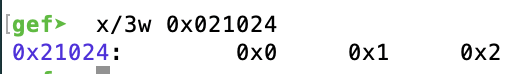

Store multiple, decrement before:
>stmdb r2, {r4-r5} /* r5 -> array_buff[1] = 0x01; r4 -> array_buff[0] = 0x00; */

Memory addresses of array_buff[1] and array_buff[0] after execution:
>gef>  x/2w 0x021024  
>0x21024:	0x0	0x1

# Push and Pop
There is a memory location within the process called Stack. The Stack Pointer (SP) is a register which, under normal circumstances, will always point to an address wihin the Stack’s memory region. Applications often use Stack for temporary data storage. And As mentioned before, ARM uses a Load/Store model for memory access, which means that the instructions LDR / STR or their derivatives (LDM.. /STM..) are used for memory operations. In x86, we use PUSH and POP to load and store from and onto the Stack. In ARM, we can use these two instructions too:

When we PUSH something onto the Full Descending stack the following happens:
1. First, the address in SP gets DECREASED by 4.
2. Second, information gets stored to the new address pointed by SP.

When we POP something off the stack, the following happens:
1. The value at the current SP address is loaded into a certain register,
2. Address in SP gets INCREASED by 4.

Source code: [push_and_pop.s](./push_and_pop.s)  

Let’s look at the disassembly of this code.
>objdump -D push_and_pop  

```bash
0x103e0 <main+16>        push   {r0,  r1}
0x103e4 <main+20>        pop    {r4,  r5}
```

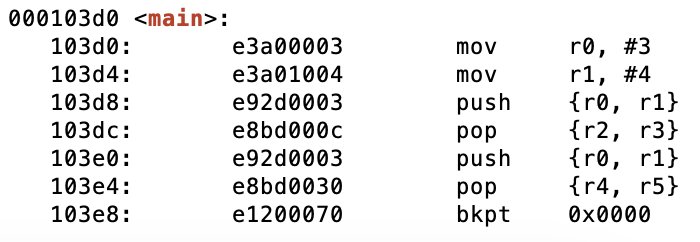
As you can see, our LDMIA and STMDB instuctions got translated to PUSH and POP. That’s because PUSH is a synonym for STMDB sp!, reglist and POP is a synonym for LDMIA sp! reglist (see ARM Manual)

Let’s run this code in GDB.
```bash
gef> b main   
gef> r  
gef> nexti 2  
[...]  
gef> x/w $sp  
0xbefff558:	0xb6fb5000
```

After running the first two instructions we quickly checked what memory address and value SP points to. The next PUSH instruction should decrease SP by 8, and store the value of R1 and R0 (in that order) onto the Stack.
```bash
gef> nexti
[...] ----- Stack -----
0xbefff550│+0x0000: 0x00000003	 ← $sp
0xbefff554│+0x0004: 0x00000004
0xbefff558│+0x0008: 0xb6fb5000  →  0x0014ff10
[...] 
gef> x/w $sp
0xbefff550:	0x3
```

Next, these two values (0x3 and 0x4) are poped off the Stack into the registers, so that R2 = 0x3 and R3 = 0x4. SP is increased by 8:
```bash
gef➤  info register r2 r3
r2             0x3                 0x3
r3             0x4                 0x4
gef➤  x/w $sp
0xbefff558:	0xb6fb5000
```

# Conditional Execution
We use conditions for controlling the program’s flow during it’s runtime usually by making jumps (branches) or executing some instruction only when a condition is met. The condition is described as the state of a specific bit in the CPSR register. Those bits change from time to time based on the outcome of some instructions.

Source code: [conditional_addition.s](./conditional_addition.s)  
The first CMP instruction in the code above triggers Negative bit to be set (2 – 3 = -1) indicating that the value in r0 is Lower Than number 3. Subsequently, the ADDLT instruction is executed because LT condition is full filled when V != N (values of overflow and negative bits in the CPSR are different). Before we execute second CMP, our r0 = 3. That’s why second CMP clears out Negative bit (because 3 – 3 = 0, no need to set the negative flag) and sets the Zero flag (Z = 1). Now we have V = 0 and N = 0 which results in LT condition to fail. As a result, the second ADDLT is not executed and r0 remains unmodified. The program exits with the result 3.

# Conditional Execution in Thumb
Some ARM processor versions support the “IT” instruction that allows up to 4 instructions to be executed conditionally in Thumb state.

Syntax: *IT{x{y{z}}} cond*
- cond specifies the condition for the first instruction in the IT block
- x specifies the condition switch for the second instruction in the IT block
- y specifies the condition switch for the third instruction in the IT block
- z specifies the condition switch for the fourth instruction in the IT block

The structure of the IT instruction is “IF-Then-(Else)” and the syntax is a construct of the two letters T and E:
- IT refers to If-Then (next instruction is conditional)
- ITT refers to If-Then-Then (next 2 instructions are conditional)
- ITE refers to If-Then-Else (next 2 instructions are conditional)
- ITTE refers to If-Then-Then-Else (next 3 instructions are conditional)
- ITTEE refers to If-Then-Then-Else-Else (next 4 instructions are conditional)

Each instruction inside the IT block must specify a condition suffix that is either the same or logical inverse. This means that if you use ITE, the first and second instruction (If-Then) must have the same condition suffix and the third (Else) must have the logical inverse of the first two. Here are some examples from the ARM reference manual which illustrates this logic:
```bash
ITTE   NE           ; Next 3 instructions are conditional
ANDNE  R0, R0, R1   ; ANDNE does not update condition flags
ADDSNE R2, R2, #1   ; ADDSNE updates condition flags
MOVEQ  R2, R3       ; Conditional move

ITE    GT           ; Next 2 instructions are conditional
ADDGT  R1, R0, #55  ; Conditional addition in case the GT is true
ADDLE  R1, R0, #48  ; Conditional addition in case the GT is not true

ITTEE  EQ           ; Next 4 instructions are conditional
MOVEQ  R0, R1       ; Conditional MOV
ADDEQ  R2, R2, #10  ; Conditional ADD
ANDNE  R3, R3, #1   ; Conditional AND
BNE.W  dloop        ; Branch instruction can only be used in the last instruction of an IT block
```

Wrong syntax:
```bash
IT     NE           ; Next instruction is conditional     
ADD    R0, R0, R1   ; Syntax error: no condition code used in IT block.
```

Source code: [ce_in_thumb.s](./ce_in_thumb.s)  
.code 32

This example code starts in ARM state. The first instruction adds the address specified in PC plus 1 to R3 and then branches to the address in R3.  This will cause a switch to Thumb state, because the LSB (least significant bit) is 1 and therefore not 4 byte aligned. It’s important to use bx (branch + exchange) for this purpose. After the branch the T (Thumb) flag is set and we are in Thumb state.

.code 16

In Thumb state we first compare R0 with #10, which will set the Negative flag (0 – 10 = – 10). Then we use an If-Then-Else block. This block will skip the ADDEQ instruction because the Z (Zero) flag is not set and will execute the ADDNE instruction because the result was NE (not equal) to 10.

# Branches
Branches (aka Jumps) allow us to jump to another code segment. This is useful when we need to skip (or repeat) blocks of codes or jump to a specific function. Best examples of such a use case are IFs and Loops.

```assembly
.global main

main:
        mov     r1, #2     /* setting up initial variable a */
        mov     r2, #3     /* setting up initial variable b */
        cmp     r1, r2     /* comparing variables to determine which is bigger */
        blt     r1_lower   /* jump to r1_lower in case r2 is bigger (N==1) */
        mov     r0, r1     /* if branching/jumping did not occur, r1 is bigger (or the same) so store r1 into r0 */
        b       end        /* proceed to the end */
r1_lower:
        mov r0, r2         /* We ended up here because r1 was smaller than r2, so move r2 into r0 */
        b end              /* proceed to the end */
end:
        bx lr              /* THE END */
```

The code above simply checks which of the initial numbers is bigger and returns it as an exit code. A C-like pseudo-code would look like this:
```C
int main() {
   int max = 0;
   int a = 2;
   int b = 3;
   if(a < b) {
    max = b;
   }
   else {
    max = a;
   }
   return max;
}
```

Now here is how we can use conditional and unconditional branches to create a loop.

```assembly
.global main

main:
        mov     r0, #0     /* setting up initial variable a */
loop:
        cmp     r0, #4     /* checking if a==4 */
        beq     end        /* proceeding to the end if a==4 */
        add     r0, r0, #1 /* increasing a by 1 if the jump to the end did not occur */
        b loop             /* repeating the loop */
end:
        bx lr              /* THE END */
```

A C-like pseudo-code of such a loop would look like this:
```C
int main() {
   int a = 0;
   while(a < 4) {
   a= a+1;
   }
   return a;
}
```

## B / BX / BLX

There are three types of branching instructions:
- Branch (B) - Simple jump to a function
- Branch link (BL) - Saves (PC+4) in LR and jumps to function
- Branch exchange (BX) and Branch link exchange (BLX)
  - Same as B/BL + exchange instruction set (ARM <-> Thumb)
  - Needs a register as first operand: BX/BLX reg

BX/BLX is used to exchange the instruction set from ARM to Thumb.

```assembly
.text
.global _start

_start:
     .code 32         @ ARM mode
     add r2, pc, #1   @ put PC+1 into R2
     bx r2            @ branch + exchange to R2

    .code 16          @ Thumb mode
     mov r0, #1
```

The trick here is to take the current value of the actual PC, increase it by 1, store the result to a register, and branch (+exchange) to that register. We see that the addition (add r2, pc, #1) will simply take the effective PC address (which is the current PC register’s value + 8 -> 0x0103d48) and add 1 to it (0x0103d48 + 1 = 0x0103d49). Then, the exchange happens if the Least Significant Bit (LSB) of the address we branch to is 1 (which is the case, because 0x0103d48 = 00000001 00000011 1101100*1*), meaning the address is not 4 byte aligned. Branching to such an address won’t cause any misalignment issues. This is how it would look like in GDB (with GEF extension):
```bash
[ Legend: Modified register | Code | Heap | Stack | String ]
───────────────────────────────────────────────────────────────────── registers ────
$r0  : 0x1   
$r1  : 0x000000befff694  →  0xf7b4
$r2  : 0x000000000103d9  →  <main+9> movs r0,  #1
$r3  : 0x000000000103d0  →  <main+0> add r2,  pc,  #1
$r4  : 0x000000000103dc  →  <__libc_csu_init+0> push {r4,  r5,  r6,  r7,  r8,  r9,  r10,  lr}
$r5  : 0x0   
$r6  : 0x000000000102e0  →  <_start+0> mov r11,  #0
$r7  : 0x0   
$r8  : 0x0   
$r9  : 0x0   
$r10 : 0x000000b6fff000  →  0x2f44
$r11 : 0x0   
$r12 : 0x000000befff548  →  0xa699
$sp  : 0x000000befff538  →  0x5000
$lr  : 0xffffffffb6e7c740
$pc  : 0x000000000103da  →  <main+10> nop ; (mov r8,  r8)
$cpsr: [negative zero CARRY overflow interrupt fast THUMB]
───────────────────────────────────────────────────────────────────────── stack ────
0x000000befff538│+0x0000: 0x5000	 ← $sp
0x000000befff53a│+0x0002: 0xb6fb
0x000000befff53c│+0x0004: 0xf694
0x000000befff53e│+0x0006: 0xbeff
0x000000befff540│+0x0008: 0x0001
0x000000befff542│+0x000a: 0x0000
0x000000befff544│+0x000c: 0x03d0
0x000000befff546│+0x000e: 0x0001
──────────────────────────────────────────────────────────────── code:arm:THUMB ────
      0x103d3 <main+3>         b.n    0x108f4
      0x103d5 <main+5>         vrhadd.u16 d14,  d2,  d31
      0x103d9 <main+9>         movs   r0,  #1
 →    0x103db <main+11>        nop    ; (mov r8,  r8)
      0x103dd <__libc_csu_init+1> blx    lr
      0x103df <__libc_csu_init+3> stmdb  sp!,  {r12,  sp,  lr}
      0x103e3 <__libc_csu_init+7> b.n    0x10726
      0x103e5 <__libc_csu_init+9> str    r0,  [r1,  #4]
      0x103e7 <__libc_csu_init+11> b.n    0xff28
```